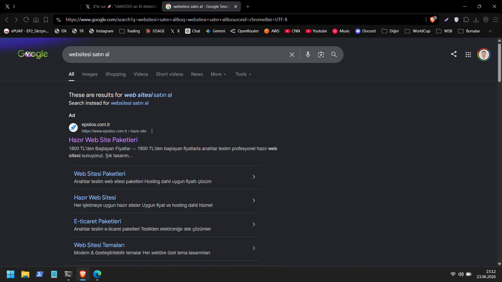
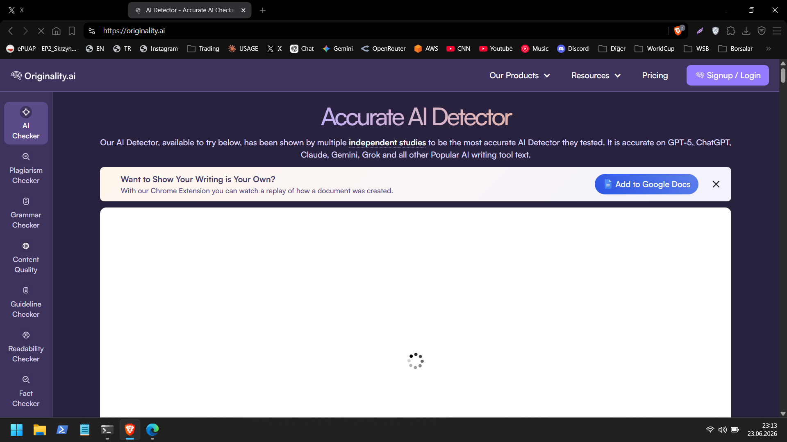

# poland-scanner

A local Python tool for scanning OLX.pl listings with saved filters. It includes a web UI, map view, seen-listing memory, favorites, and notifications. Two categories are currently supported: home rentals and cars.

## Features

- Web UI for city, district, price, area, rooms, furnishing, year, mileage, and keyword filters.
- Address-radius filtering with a Leaflet/OpenStreetMap map view.
- Local `seen.json` memory for tracking new listings.
- Browser localStorage favorites.
- Console, sound, Telegram, ntfy, and custom command notifications.
- CLI commands for one-off scans, periodic watching, and generated OLX URLs.

## Installation

```powershell
python -m venv .venv
.\.venv\Scripts\Activate.ps1
python -m pip install -r requirements.txt
python poland_scanner.py init --config config.json
```

`config.json` is your personal settings file and is ignored by Git. Defaults come from [config.example.json](./config.example.json).

## Web UI





```powershell
python poland_scanner.py --config config.json serve
```

Open this address in your browser:

```text
http://localhost:8000
```

You do not need to paste an OLX URL in the web UI. Choose the city and district from lists, then set price, rooms, area, furnishing, keywords, and excluded keywords from the form.

For address-radius filtering, enter an address, set a radius in kilometers, and click `Find address`. The map shows the search center, radius, and approximate OLX listing locations.

When `Hide seen listings` is enabled, a scan only displays listings that were not seen before. When it is disabled, all matches are shown while the seen memory is still updated.

## CLI Usage

Run one scan:

```powershell
python poland_scanner.py --config config.json scan
```

On the first run, current listings are stored in `seen.json` and notifications are not sent by default. To notify for all current results:

```powershell
python poland_scanner.py --config config.json scan --notify-current
```

Run periodic scans:

```powershell
python poland_scanner.py --config config.json watch
```

While the watcher is running, type `scan` for an immediate scan or `q` to quit.

Print the OLX URL generated from the config:

```powershell
python poland_scanner.py --config config.json url
```

Legacy `python olx_rent_watcher.py ...` commands still work for backward compatibility.

## Notifications

The default notification output is the terminal plus a short sound. To enable Telegram, set `notifications.telegram.enabled` to `true` and provide `bot_token` and `chat_id`. You can also keep secrets out of config and use environment variables:

```powershell
$env:TELEGRAM_BOT_TOKEN="123:abc"
$env:TELEGRAM_CHAT_ID="123456"
python poland_scanner.py --config config.json watch
```

For ntfy, set `notifications.ntfy.enabled` to `true` and provide a unique `topic`.

In the web UI, `Send scan to Telegram` sends the currently displayed scan results to the Telegram chat configured in `config.json` or environment variables. This manual action does not require `notifications.telegram.enabled` to be `true`; it only needs a bot token and chat ID.

## Development

Install development dependencies:

```powershell
python -m pip install -r requirements-dev.txt
```

Run checks:

```powershell
python -m pytest
python -m py_compile poland_scanner.py olx_rent_watcher.py
```

## Before Publishing

- `config.json`, `seen.json`, `translations.json`, logs, `.env`, and temporary server files are ignored by Git.
- Keep Telegram tokens in environment variables instead of committed config files. See [.env.example](./.env.example).

## License

This project is licensed under the [MIT License](./LICENSE).

## Notes

- The tool extracts API parameters from public OLX search pages and uses the `api/v1/offers` endpoint.
- Keep intervals reasonable: the default is 10 minutes, and 1 minute is the practical minimum.
- The tool does not log in, bypass CAPTCHAs, or perform high-rate request behavior.
